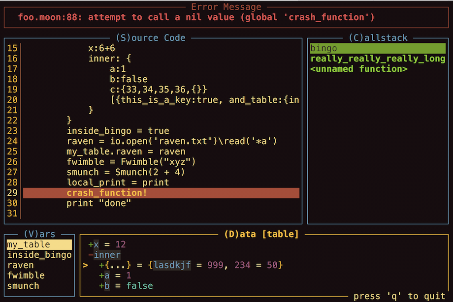

# Lua Debugging TUI

This is a text-based user interface command line debugging utility for Lua and Moonscript.
It lets you browse the call stack, source code, and local variables right at the moment when
your code crashes, or you call `ldt.breakpoint()`. Moonscript is fully supported, so the
callstack and source code panes will display the correct source for functions written in
Moonscript.



## Requirements

This library uses Curses via the [lcurses](https://github.com/rrthomas/lcurses) library
and [LPeg](http://www.inf.puc-rio.br/~roberto/lpeg).

## Usage

To catch all errors inside a block of code, use:

```Lua
local ldt = require("ldt")
ldt.guard(function()
    -- Your crashing code here
end)
```

To trigger a breakpoint, just add a call to `ldt.breakpoint()`. Also, you can use `ldt.hijack()`
to replace `error()` and `assert()` with functions that will trigger the debugger. However,
this is not recommended for general purpose debugging because Lua errors like trying to index
a nil value do not call `error()`, so the debugger won't get triggered.

## Navigation

* Press 'q' to quit
* Arrow keys or h/j/k/l for movement within the active pane (yellow border); scroll wheel also works, but only for vertical scrolling. Shift+h/j/k/l moves 10 lines at a time.
* Press 'c' to select the call stack pane
* Press 's' to select the source code pane (showing the source code for the file of the function selected in the callstack pane)
* Press 'o' to open the selected file to the selected line in your system's default editor (`$EDITOR`)
* Press 'v' to select the variables pane (showing the variables at the selected level of the callstack)
* Press 'd' to select the data pane (showing the value of the selected variable)
    * In the data pane, 'l'/right will expand table entries, and 'h'/left will collapse table entries.
